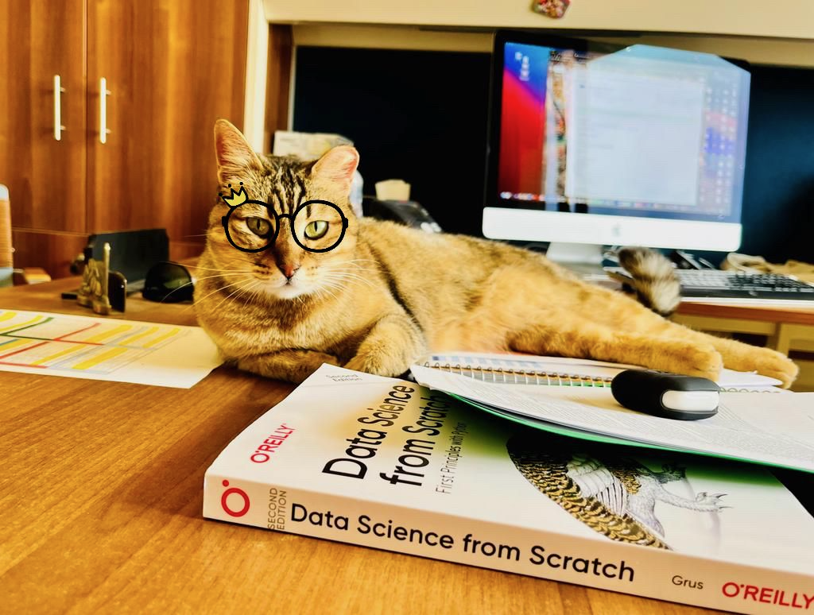

# AUC Fundamentals of Data Science II (DSCI1412) Spring 2023

- Lecture 00 - Course Introduction
- Lecture 01 - Introduction to Python  [Slides](https://ahmedmoustafa.github.io/AUC-Fundamentals-of-Data-Science-II-Spring-2023/lecture01.html) | [Notebook](notebooks/lecture01.ipynb) | [PDF](pdfs/lecture01.pdf) | [Classroom Live Coding](livecoding/lecture01.ipynb)
